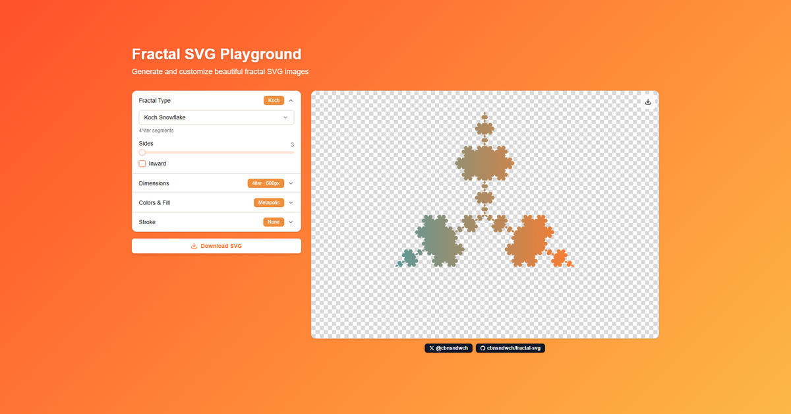

# @cbnsndwch/fractal-svg

A TypeScript monorepo for generating beautiful, self-similar fractal patterns in SVG format. Includes an isomorphic generator library, CLI tool, React components, and interactive playground.

[](https://fractals.cbnsndwch.dev/)


**[🎮 Try the Live Demo →](https://fractals.cbnsndwch.dev/)**

## Features

- 🎨 **10 Fractal Types** - From classic Sierpinski carpets to space-filling curves
- 📐 **Vector Output** - Clean, scalable SVG files
- 🌈 **Gradient Support** - Multi-color linear gradients at any angle
- 🖼️ **Circular Backgrounds** - Optional circular backdrop behind fractals
- ⚡ **Efficient Rendering** - Line-based fractals use single `<path>` elements
- 🎮 **Interactive & CLI Modes** - User-friendly prompts or scriptable commands
- ⚛️ **React Components** - Drop-in components for your React applications
- 🏗️ **Monorepo Structure** - Modular packages managed with Turborepo

## Packages

This monorepo contains four packages:

| Package | Description | Version |
|---------|-------------|---------|
| [@cbnsndwch/fractal-generator](./packages/fractal-generator) | Isomorphic SVG generation library | 0.1.0 |
| [@cbnsndwch/fractal-cli](./packages/fractal-cli) | Command-line interface tool | 0.1.0 |
| [@cbnsndwch/fractal-react](./packages/fractal-react) | React component library | 0.1.0 |
| [demo](./apps/demo) | [Interactive playground](https://fractals.cbnsndwch.dev/) | - |

## Installation

### Using the CLI Tool

```bash
# Install globally
npm install -g @cbnsndwch/fractal-cli

# Run in interactive mode
fractal-svg

# Or use npx
npx @cbnsndwch/fractal-cli koch --sides 6 --iter 4
```

### Using the Generator Library

```bash
npm install @cbnsndwch/fractal-generator
```

### Using React Components

```bash
npm install @cbnsndwch/fractal-react
```

### Development Setup

```bash
# Clone the repository
git clone https://github.com/cbnsndwch/fractal-svg.git
cd fractal-svg

# Install dependencies
pnpm install

# Build all packages
pnpm build

# Run CLI in development mode
pnpm dev
```

## Quick Start

### CLI Usage

#### Interactive Mode

```bash
# Using global installation
fractal-svg

# Or using npx
npx @cbnsndwch/fractal-cli
```

#### Command Line Mode

```bash
# Koch snowflake
fractal-svg koch --sides 3 --iter 4 --stroke black

# Sierpinski carpet with gradient
fractal-svg carpet 1.8928 --gradient "#ff6b6b,#4ecdc4" --size 512

# Dragon curve
fractal-svg dragon --iter 12 --stroke "#ff6b6b" --strokeWidth 1.5

# Mandelbrot set boundary
fractal-svg mandelbrot --gradient "#22c55e,#06b6d4,#3b82f6" --resolution 512
```

### Library Usage

```typescript
import { generateKochCurve, generateDragonCurve } from '@cbnsndwch/fractal-generator';

// Generate a Koch snowflake
const svg = generateKochCurve({
  sides: 6,
  iterations: 4,
  size: 512,
  fill: '#3b82f6'
});

// Generate a Dragon curve
const dragonSvg = generateDragonCurve({
  iterations: 12,
  size: 512,
  stroke: '#ff6b6b',
  strokeWidth: 1.5
});
```

### React Usage

```tsx
import { FractalGenerator } from '@cbnsndwch/fractal-react';

function MyComponent() {
  return (
    <FractalGenerator
      type="koch"
      options={{
        sides: 6,
        iterations: 4,
        size: 512,
        fill: '#3b82f6'
      }}
    />
  );
}
```

## Supported Fractal Types

| Fractal | Description | Rendering |
|---------|-------------|-----------|
| `carpet` | Sierpinski-style grid carpet | Rectangles |
| `koch` | Koch curve snowflake/polygon | Path (filled) |
| `mandelbrot` | Mandelbrot set boundary | Contour path |
| `julia` | Julia set with customizable constant | Contour path |
| `dragon` | Dragon curve (L-system) | Path (stroked) |
| `hilbert` | Hilbert space-filling curve | Path (stroked) |
| `levy` | Lévy C curve (feathery pattern) | Path (stroked) |
| `sierpinski` | Sierpinski arrowhead curve | Path (stroked) |
| `peano` | Peano space-filling curve | Path (stroked) |
| `gosper` | Gosper flowsnake curve | Path (stroked) |

## Usage Guide

### Carpet Fractals

The carpet fractal creates Sierpinski-style patterns using recursive grid subdivision.

```bash
fractal-svg carpet <dimension> [options]
```

**Parameters:**
- `<dimension>` - Fractal dimension (0, 2]. Classic Sierpinski carpet is ~1.8928

**Options:**
| Option | Description | Default |
|--------|-------------|---------|
| `--kMin <n>` | Minimum subdivision factor | 2 |
| `--kMax <n>` | Maximum subdivision factor | 9 |
| `--maxRects <n>` | Max rectangles before stopping | 40000 |

**Examples:**
```bash
# Classic Sierpinski carpet
fractal-svg carpet 1.8928 --iter 4

# Low-dimension carpet with gradient
fractal-svg carpet 0.63 --gradient "#f59e0b,#ef4444" --size 256
```

### Koch Curves

Generate Koch curve fractals with customizable polygon bases.

```bash
fractal-svg koch [options]
```

**Options:**
| Option | Description | Default |
|--------|-------------|---------|
| `--sides <n>` | Number of sides (3 = snowflake, 4 = square) | 3 |
| `--inward` | Make bumps point inward | false |

**Examples:**
```bash
# Classic Koch snowflake
fractal-svg koch --sides 3 --iter 4 --fill "#3b82f6"

# Hexagonal Koch with gradient
fractal-svg koch --sides 6 --iter 3 --gradient "#22c55e,#3b82f6"

# Square Koch with inward bumps
fractal-svg koch --sides 4 --inward --stroke black --strokeWidth 2
```

### Mandelbrot Set

Render the boundary of the famous Mandelbrot set using contour tracing.

```bash
fractal-svg mandelbrot [options]
```

**Options:**
| Option | Description | Default |
|--------|-------------|---------|
| `--resolution <n>` | Grid resolution for contour tracing | 256 |
| `--centerX <n>` | Center X in complex plane | -0.5 |
| `--centerY <n>` | Center Y in complex plane | 0 |
| `--zoom <n>` | View width in complex plane | 3 |
| `--maxIter <n>` | Max escape iterations | 100 |
| `--threshold <n>` | Contour threshold level | 2 |

**Examples:**
```bash
# Default Mandelbrot
fractal-svg mandelbrot --gradient "#22c55e,#06b6d4,#3b82f6"

# Zoomed into an interesting region
fractal-svg mandelbrot --centerX -0.75 --zoom 0.5 --resolution 512
```

### Julia Sets

Generate Julia set boundaries with customizable complex constant c.

```bash
fractal-svg julia [options]
```

**Options:**
| Option | Description | Default |
|--------|-------------|---------|
| `--juliaReal <n>` | Real part of c constant | -0.7 |
| `--juliaImag <n>` | Imaginary part of c constant | 0.27015 |
| `--resolution <n>` | Grid resolution | 256 |
| `--centerX <n>` | Center X in complex plane | 0 |
| `--centerY <n>` | Center Y in complex plane | 0 |
| `--zoom <n>` | View width | 3.5 |

**Famous Julia Set Constants:**
```bash
# Dendrite pattern (default)
fractal-svg julia --juliaReal -0.7 --juliaImag 0.27015

# Spiral arms
fractal-svg julia --juliaReal -0.8 --juliaImag 0.156

# Rabbit-like
fractal-svg julia --juliaReal -0.4 --juliaImag 0.6

# Sea horse valley
fractal-svg julia --juliaReal 0.285 --juliaImag 0.01

# Lightning bolts
fractal-svg julia --juliaReal -0.70176 --juliaImag -0.3842
```

### L-System Fractals

These fractals use L-system (Lindenmayer system) rules and are rendered as single SVG paths.

#### Dragon Curve

```bash
fractal-svg dragon --iter 12 --stroke "#ff6b6b" --strokeWidth 1.5
```

#### Hilbert Curve

A space-filling curve that visits every point in a grid.

```bash
fractal-svg hilbert --iter 6 --stroke "#3b82f6" --strokeWidth 1
```

#### Lévy C Curve

A beautiful feathery symmetric pattern.

```bash
fractal-svg levy --iter 14 --stroke "#22c55e" --strokeWidth 0.5
```

#### Sierpinski Arrowhead

Line-based version of the Sierpinski triangle.

```bash
fractal-svg sierpinski --iter 10 --stroke "#f59e0b"
```

#### Peano Curve

The original space-filling curve with 3×3 subdivision.

```bash
fractal-svg peano --iter 4 --stroke "#8b5cf6"
```

#### Gosper Curve (Flowsnake)

A hexagonal space-filling curve with an organic shape.

```bash
fractal-svg gosper --iter 4 --stroke "#ec4899"
```

## Common Options

These options work with all fractal types:

| Option | Description | Default |
|--------|-------------|---------|
| `--out <file>` | Output SVG filename | `<type>.svg` |
| `--size <px>` | Canvas size in pixels (min: 64) | 512 |
| `--iter <n>` | Iteration depth | type-specific |
| `--bg <color>` | Background color | transparent |
| `--circleBg <color>` | Circular background behind fractal | none |
| `--fill <color>` | Fill color | type-specific |
| `--gradient <colors>` | Comma-separated gradient stops | none |
| `--gradientAngle <n>` | Gradient angle in degrees | 135 |
| `--stroke <color>` | Stroke color | type-specific |
| `--strokeWidth <n>` | Stroke width | type-specific |
| `--margin <px>` | Margin around the fractal | 10 |

### Gradient Example

```bash
fractal-svg koch --sides 5 --iter 4 \
  --gradient "#ff6b6b,#4ecdc4,#45b7d1" \
  --gradientAngle 90 \
  --size 1024
```

### Circular Background

Add a circular background behind your fractal (useful for logo designs):

```bash
fractal-svg dragon --iter 12 \
  --circleBg "#1e1e1e" \
  --stroke "#ffffff" \
  --bg transparent
```

## Iteration Limits

Each fractal type has recommended iteration limits to prevent memory exhaustion:

| Fractal | Default | Maximum | Complexity |
|---------|---------|---------|------------|
| carpet | 4 | 8 | N^iter rectangles |
| koch | 4 | 7 | 4^iter segments |
| mandelbrot | 4 | 10 | resolution-based |
| julia | 4 | 10 | resolution-based |
| dragon | 12 | 18 | 2^iter segments |
| hilbert | 6 | 9 | 4^iter segments |
| levy | 14 | 18 | 2^iter segments |
| sierpinski | 10 | 14 | 3^iter segments |
| peano | 4 | 6 | 9^iter segments |
| gosper | 4 | 6 | 7^iter segments |

## Output

All fractals are generated as square SVG files with the fractal centered in the viewport. The fractal is designed to fit within a circle inscribed in the square, respecting the margin parameter.

Output files are saved to the `output/` directory by default:

```
output/
├── carpet.svg
├── koch.svg
├── dragon.svg
└── logos/
    └── my-logo.svg
```

## Development

This project uses Turborepo to manage the monorepo workflow.

### Building

```bash
# Build all packages
pnpm build

# Build in watch mode
pnpm dev

# Type check all packages
pnpm types

# Lint all packages
pnpm lint
```

### Project Structure

```
fractal-svg/
├── packages/
│   ├── fractal-generator/    # Core SVG generation library
│   │   ├── src/
│   │   │   ├── index.ts       # Main exports
│   │   │   ├── generators/    # Individual fractal generators
│   │   │   ├── types.ts       # TypeScript types
│   │   │   └── utils.ts       # Shared utilities
│   │   └── package.json
│   ├── fractal-cli/           # CLI tool
│   │   ├── src/
│   │   │   └── index.ts       # CLI implementation
│   │   └── package.json
│   └── fractal-react/         # React components
│       ├── src/
│       │   ├── index.ts       # Component exports
│       │   └── FractalGenerator.tsx
│       └── package.json
├── apps/
│   └── demo/                  # Interactive playground
│       ├── app/               # Next.js app directory
│       └── package.json
├── docs/                      # Documentation
├── scripts/
│   └── ralph/                 # AI-assisted development tooling
└── turbo.json                 # Turborepo configuration
```

### Publishing

This monorepo uses [changesets](https://github.com/changesets/changesets) for version management and publishing.

```bash
# Add a changeset (describe your changes)
pnpm changeset

# Update package versions based on changesets
pnpm version-packages

# Build and publish to npm
pnpm release
```

## Design Principles

When this library generates fractals, it follows these invariants:

1. **Square Output** - Width and height are always equal
2. **Centered Fractals** - All fractals are centered at `(size/2, size/2)`
3. **Circular Bounding** - Fractals fit within an inscribed circle with radius `size/2 - margin`

## Contributing

Contributions are welcome! Some ideas for future enhancements:

- [ ] Generic L-system engine for custom user-defined fractals
- [ ] Auto-scale strokeWidth based on iteration count
- [ ] Animation support (CSS or SMIL)
- [ ] Additional fractal types (Barnsley fern, tree fractals, etc.)

## License

MIT © [cbnsndwch](https://cbnsndwch.io)

---

<p align="center">
  Made with 🔷 fractal mathematics
</p>
